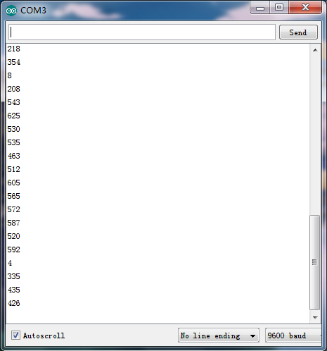

# Arduino


## 1. Arduino简介  

Arduino是一款开源电子原型平台，结合了硬件和软件，旨在让初学者和专业人士能够更轻松地进行电子和编程项目。Arduino控制板是基于微控制器的硬件设备，适用于各种编程项目，广泛用于学习、快速原型开发和产品创意。  

Arduino的核心是其灵活性和易用性。用户可以用C/C++编程语言编写代码，并通过Arduino IDE（集成开发环境）进行开发、编译和上传到控制板。Arduino支持多种传感器、模块和附加硬件，使其能够实现从简单的LED控制到复杂的机器人项目等多种功能。强大的用户社区和丰富的在线资源使得学习Arduino变得更加简单和高效。  

## 2. 连接图  

  

## 3. 测试代码  

```cpp  
int s_pin = A0;  

void setup() {  
    Serial.begin(9600);  
    pinMode(s_pin, INPUT);  
}  

void loop() {  
    Serial.println(analogRead(s_pin));  
    delay(500);  
}  
```  

## 4. 代码说明  

1. **变量定义**：定义一个整型变量`s_pin`，用来指定连接压力传感器的模拟引脚（A0）。  

2. **`setup`函数**：在`setup`函数中，设置串口通讯的波特率为9600，并将`s_pin`设置为输入模式，以便读取传感器的数据。  

3. **`loop`函数**：在循环中，使用`analogRead(s_pin)`读取压力传感器的模拟值，并将其打印到串口监视器中。每次读取后会延迟500毫秒，以避免信息更新过快而难以观察。  

## 5. 测试结果  

接好线。上传好代码，上电后，打开Arduino IDE串口监视器，用手按压压力传感器，监视窗口的数值变小，说明传感器正常，如下图。




