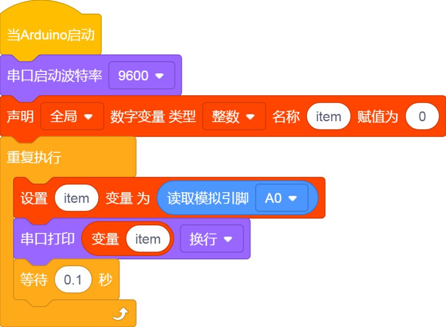
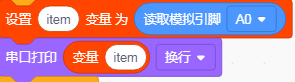
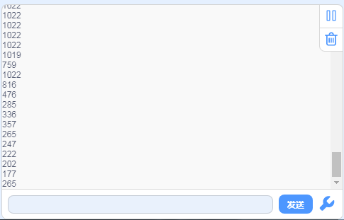

# KidsBlock

## 1. Kidsblock简介  

Kidsblock是一款专为儿童和初学者设计的可视化编程工具，旨在通过简单的图形化界面来帮助用户轻松学习编程与电子技术。它采用拖放式编程的方式，让用户无需深入了解复杂的编程语法便能创建自己的项目，适合多种硬件平台，比如Arduino、Micro:bit等。  

Kidsblock的主要特点包括丰富的传感器和模块支持，用户可以通过拼接各种模块来实现机器人控制、传感器应用、游戏开发等功能。这个平台强调互动性和实践性，鼓励孩子们在实验中探索和创造，培养他们的逻辑思维及解决问题的能力。  

## 2. 连接图  

  

## 3. 测试代码  

  

## 4. 代码说明  

**代码下载**

### 4.1 创建变量  

在实验中，我们创建了一个整数变量`item`。  

  

### 4.2 读取模拟值  

连接使用的管脚为模拟口A0，因此无需更改。读取的模拟值被赋给变量`item`，并通过串口监视器显示该值。  

  

## 5. 测试结果  

上传测试代码成功后，利用USB接口上电。当我们用手挤压薄膜传感器时，可以在串口监视器中看到打印的模拟值变小，如下图所示。  

