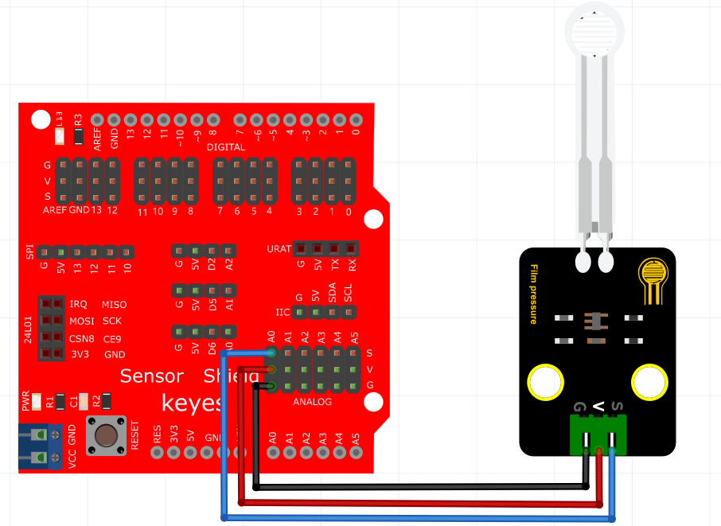
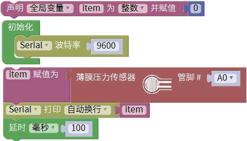
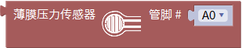
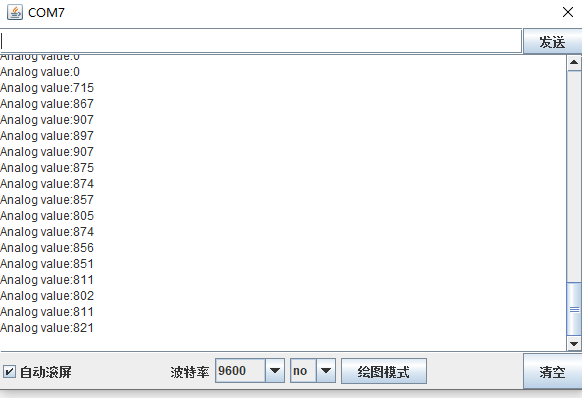

# Mixly

## 1. Mixly简介  

Mixly是一款易于使用的可视化编程工具，旨在帮助初学者学习编程和电子技术。它通过图形化界面允许用户以拖放的方式构建程序，无需掌握复杂的编程语法。Mixly支持多种平台，包括Arduino、Micro:bit等，也具有丰富的传感器和模块库，适合用于教育和个人项目。  

Mixly集成了多种功能，允许用户通过简单的模块组合完成复杂的项目，如传感器数据读取、机器人控制等。它的设计理念是将编程和电子实验结合起来，让学习者通过实践来掌握技能，提高他们的创造力和问题解决能力。丰富的在线资源和社区支持让学习者能够轻松找到帮助和灵感。  

## 2. 接线图  

  

## 3. 测试代码（软件版本：Mixly1.2.0）  

  

## 4. 代码说明

下载：

* [库文件](./mixly/库文件.rar)
* [代码](./mixly/code/薄膜压力.mix)

### 4.1 创建变量  

在实验中，创建一个整数变量`item`。  

  

### 4.2 读取模拟值  

在我们导入的库`keyes sensor`下的“模拟输入”单元找到模拟薄膜压力传感器模块。由于我们将管脚连接到模拟口A0，因此无需更改。  

  

### 4.3 显示值  

读取的模拟值赋给变量`item`，并通过串口监视器显示此值（我们默认设置为9600波特率，可根据需要更改）。  

## 5. 测试结果  

接好线。上传好代码，上电后，打开 Mixly的串口监视器，用手按压压力传感器，监视窗口的数值变小，说明传感器正常，如下图。

