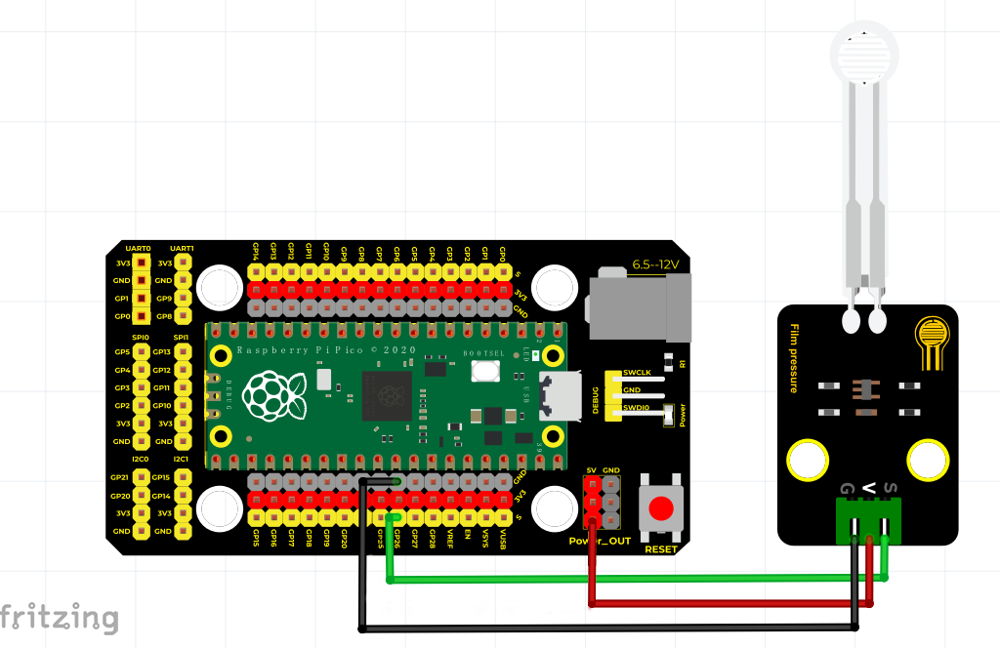
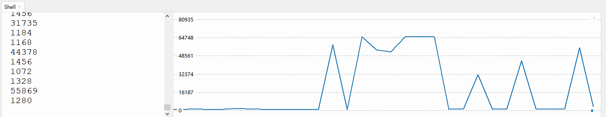

# Python


## 1. Python简介  

Python是一种强大且易于学习的高级编程语言，广泛应用于Web开发、数据分析、人工智能、科学计算和自动化脚本等领域。其简单易读的语法使得初学者和专业开发人员都能迅速上手。Python支持多种编程范式，包括面向对象、过程式和函数式编程，提高了其灵活性和可扩展性。  

Python拥有丰富的标准库和众多第三方库，使得处理复杂任务变得更加容易。比如使用NumPy进行科学计算、Pandas进行数据分析、Flask和Django进行Web开发等。此外，Python的活跃社区提供了大量的学习资源、文档和示例代码，帮助用户在学习和开发过程中获得支持。  

## 2. 连接图  

  

## 3. 测试代码（软件：Thonny）  

```python  
import utime  

potentiometer = machine.ADC(26)  # 将GP26作为模拟信号采集引脚  

while True:  
    voltage = potentiometer.read_u16()  
    print(voltage)  # 打印模拟值  
    utime.sleep(0.1)  
```  

## 4. 代码说明  

1. **导入模块**：首先导入`utime`模块，它用于实现延时功能。  

2. **设置引脚**：使用`machine.ADC(26)`将GP26配置为模拟信号采集引脚，以读取传感器的模拟信号。  

3. **循环读取**：在一个无限循环中，使用`potentiometer.read_u16()`读取引脚上的模拟值，并将其赋值给变量`voltage`。  

4. **打印值**：通过`print(voltage)`将读取到的模拟值打印到控制台，用于监视传感器的输出。  

5. **延时**：最后调用`utime.sleep(0.1)`使程序暂停0.1秒，以控制读取频率。  

## 5. 测试结果  

接好线，上传代码并运行程序后，在Thonny的串口监视器中观察。当用手按压压力传感器时，监视窗口中的数值会不断增大，表明传感器工作正常，如下图所示。  




